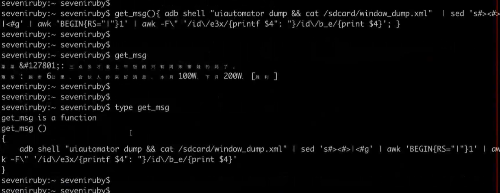
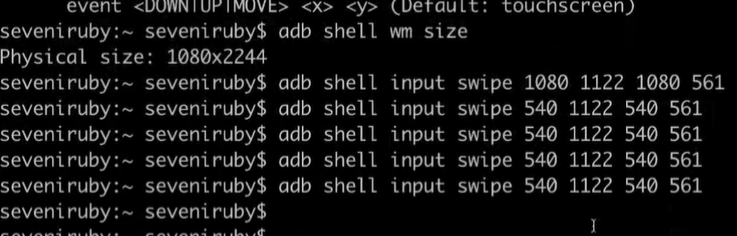
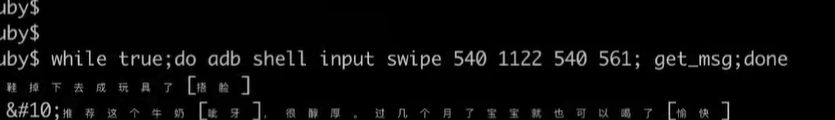

`adb shell "uiautomator dump && cat /sdcard/window_dump.xml" >/1`
`while true;do 
   adb shell input swipe 540 2200 540 200; 
   adb shell "uiautomator dump && cat /sdcard/window_dump.xml" | 
     sed 's#><#>|<#g' |  
     awk -F \" 'BEGIN{RS="|"}/id\/e3x/{printf $4": "}/id\/b_e/{print $4}'
 done`

