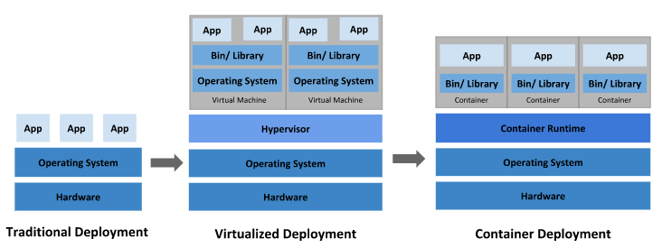

### 官网
 <https://kubernetes.io/docs/concepts/overview/what-is-kubernetes/>
### 基本资料
#### 什么是k8s

#### k8s架构
- k8s由master和node构成，master负责控制node

- k8s的所有操作通过kubectl指令操作
#### k8s命令和工具
- 查看kubectl版本
```
kubectl version -o json
```
- 工具包和用途 
kubeadm：引导集群的命令。

kubelet：在集群中所有计算机上运行的组件，它执行诸如启动Pod和容器之类的操作。

kubectl：用于与您的集群通信的命令行工具。


