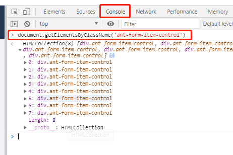

- 特殊操作操作
	验证控件颜色
		https://www.selenium.dev/documentation/en/support_packages/working_with_colours/
		import org.openqa.selenium.support.Color;
		抓取css控件，使用RGB或RGBA色号验证控件颜色
	选择下拉选项控件
		https://www.selenium.dev/documentation/en/support_packages/working_with_select_elements/
		import org.openqa.selenium.support.ui.Select;
		选择select控件的某一个选项，或者全部不勾选
	鼠标动作控制
		https://www.selenium.dev/documentation/en/support_packages/mouse_and_keyboard_actions_in_detail/
		单击不松手：clickAndHold
		右键单击：contextClick
		双击：doubleClick
		鼠标移至元素中心：moveToElement
		鼠标从当前位置偏移：moveByOffset
		按住-从元素A拖拽至元素B-释放：dragAndDrop
		对于某个元素拖拽对应偏移量后释放:dragAndDropBy
		释放：perform
	cookie操作
		https://www.selenium.dev/documentation/en/support_packages/working_with_cookies/
		增删cookie
	模拟地理位置
		chrome专用
		https://www.selenium.dev/documentation/en/support_packages/chrome_devtools/
	webdriver可以设置
		browserName
		browserVersion
		pageLoadStrategy
		platformName
		acceptInsecureCerts
			接收不安全的证书
		Session timeouts
			Script Timeout:
				默认超时为30,000
			Page Load Timeout:
				默认超时为30,000
				TimeoutException
			Implicit Wait Timeout
				默认超时0
		https://www.selenium.dev/documentation/en/driver_idiosyncrasies/shared_capabilities/
		unhandledPromptBehavior
			User Prompt Handler
			默认为关闭并通知状态
			定义了在远端出现用户提示时必须采取的措施
				dismiss
				accept
				dismiss and notify
				accept and notify
				ignore
		setWindowRect
			浏览器屏幕大小
			maximized
			minimized
			normal
			fullscreen
		strictFileInteractability
			对于输入文件进行严格的交互检查
控件定位
- 元素定位代码写法
	在页面中寻找class
		chrome-F12-console-document.getElementsByClassName('ant-form-item-control')
		
	页面中按照text查找
		xpath = "//button/span[text()=\"新增今日早报\"]"
		标签的最后一个 last()
chromeOption
	做一些启动浏览器的默认配置
	https://sites.google.com/a/chromium.org/chromedriver/capabilities
	最大化启动：options.addArguments("start-maximized");
	使用chrome执行文件：options.setBinary("/path/to/other/chrome/binary");
	阻止弹出窗口：options.setExperimentalOption("excludeSwitches",
    Arrays.asList("disable-popup-blocking"));
	设置下载目录
	安装一些插件
	使用chrome的代码行
		https://peter.sh/experiments/chromium-command-line-switches/
	chrome.chromedriverVersion
	userDataDir
chromedriver
	下载版本选择
		以下是选择要下载的ChromeDriver版本的步骤：
首先，找出您使用的Chrome版本。假设您有Chrome 72.0.3626.81。
获取Chrome版本号，删除最后一部分，然后将结果附加到网址“ https://chromedriver.storage.googleapis.com/LATEST_RELEASE_”。例如，对于Chrome版本72.0.3626.81，您将获得一个网址“ https://chromedriver.storage.googleapis.com/LATEST_RELEASE_72.0.3626”。
使用在上一步中创建的URL检索包含要使用的ChromeDriver版本的小文件。例如，上述URL将使您的文件包含“ 72.0.3626.69”。（当然，实际数字将来可能会更改。）
使用从上一步中获取的版本号来构造URL以下载ChromeDriver。在72.0.3626.69版中，URL为“ https://chromedriver.storage.googleapis.com/index.html?path=72.0.3626.69/”。
初始下载后，建议您偶尔进行上述过程，以查看是否有任何错误修复版本。
		ChromeDriver使用与Chrome相同的版本编号方案。有关更多详细信息，请参见https://www.chromium.org/developers/version-numbers
		https://sites.google.com/a/chromium.org/chromedriver/downloads/version-selection
	更新版本
		https://sqa.stackexchange.com/questions/41928/how-to-autoupdate-chrome-driver-in-selenium
	加快启动和关闭chromeDriver
		https://sites.google.com/a/chromium.org/chromedriver/getting-started
geckodriver
	下载版本选择
		https://firefox-source-docs.mozilla.org/testing/geckodriver/Support.html		
- 切换窗口
 当有多个窗口时，切换窗口：
 句柄driver.getWindowHandler();
 driver.switchTo.window(name);
 
- 查询xpath在chrome中的验证
 chrome->console->$x("xpathargs")
- 查询classname 再chrome中的验证
 chrome->console->$a('')
 
- UI自动化 ：Qekafe
	<https://www.qekafe.com/	>
		
	