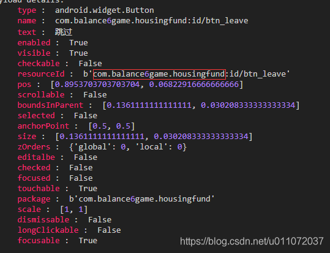
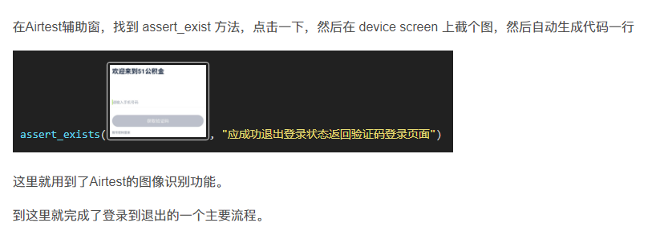

###原理拆解
1.基于poco和airtest：  
- poco是一个跨引擎的 UI 自动化框架 https://github.com/AirtestProject/Poco  
- airtest是一个跨平台的UI自动化框架，适用于游戏和App https://github.com/AirtestProject/Airtest    

2.模拟输入基于图像识别  
目前我们支持图像识别的方式来找到你想要点击的位置并对其进行操作。这是基于框架Airtest。  
Other analog input API includes:  
text: text input  
keyevent: key input, including (HOME/BACK/MENU, etc.)  
sleep: wait  
snapshot: screen capture  

3.基于 UI 控件  
如果你发现图像识别不够准确，可以使用基于UI控件搜索的方法进行自动化测试。与Airtest不同，这是Poco框架实现的功能。目前Poco直接支持Unity3d、Cocos2d、Egret Engine、Android/iOS原生应用等多种游戏引擎。  
  
### 使用过程
打开app，在IDE辅助窗将模式切换成Android，并选中Inspector按钮，将鼠标移动到app的任意控件上，可能会有卡顿，那是IDE在往手机上装必须的软件。

然后log输出窗里，会出现很多信息，包括卸载app需要用到的包名。

得到包名为“com.balance6game.housingfund”。

唤醒 wake()
安装apk install("xxx.apk")
卸载apk uninstall("packageName")
poco定位控件：
poco(text="xxx") 
poco(name="xxx") 
输入文字 text(xxx)
assert

