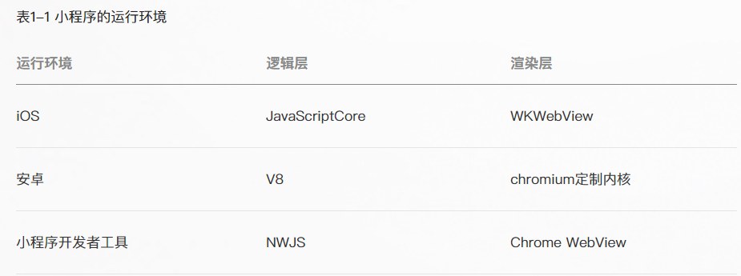

小程序的原理
--
> 本文参考 <https://mp.weixin.qq.com/s/U0jFiRsVsChHb8K9995QKQ>  
> 微信官方文档 <https://developers.weixin.qq.com/miniprogram/dev/framework/quickstart/#%E5%B0%8F%E7%A8%8B%E5%BA%8F%E6%8A%80%E6%9C%AF%E5%8F%91%E5%B1%95%E5%8F%B2>  

一、小程序的技术组成和调试
---
#### 技术组成  
- 基于webview,使用js开发



  
**wx496be6b7f150698f:pack-manager/pages/manager-view/manager-view.html:VISIBLE**  
#### 小程序调试
- 1.在私信聊天页，输入<http://debugx5.qq.com>
- 2.勾选【打开 TBS 内核 Inspector 调试功能】

- 3.查看小程序进程
    - 1.未开启微信，搜索结果为空
    ```shell script
    1|HWVOG:/ $ ps -A|grep "tencent.mm"
    ```
    - 2.开启微信，搜索到一堆
    ```shell script
    1|HWVOG:/ $ ps -A|grep "tencent.mm"
    u0_a150       7177   669 13103960 530692 0                  0 S com.tencent.mm
    u0_a150       7663   669 7035788 239596 0                   0 S com.tencent.mm:push
    u0_a150       9202   669 7956712 394832 0                   0 S com.tencent.mm:toolsmp
    u0_a150       9904   669 12304088 384400 0                  0 S com.tencent.mm:appbrand0
    u0_a150       9920   669 11289156 337096 0                  0 S com.tencent.mm:appbrand1
    u0_a150      10830   669 12062020 310952 0                  0 S com.tencent.mm:tools
    u0_a150      11201   669 6525516 236188 0                   0 S com.tencent.mm:hld
    u0_a150      11755   669 6877744 236672 0                   0 S com.tencent.mm:sandbox 
    ```
    - 3.当前top的进程是 7177,即com.tencent.mm
    ```shell script
    HWVOG:/ $ dumpsys  activity top|grep ACTIVITY
      ACTIVITY com.huawei.android.launcher/.unihome.UniHomeLauncher 57be321 pid=2884
      ACTIVITY com.tencent.mm/.ui.LauncherUI 5823c09 pid=7177
    ```
    - 4.打开小程序，查看top进程,即AppBrand
    ```shell script
    HWVOG:/ $ dumpsys  activity top|grep ACTIVITY
      ACTIVITY com.huawei.android.launcher/.unihome.UniHomeLauncher 57be321 pid=2884
      ACTIVITY com.tencent.mm/.ui.LauncherUI 5823c09 pid=7177
      ACTIVITY com.tencent.mm/.plugin.appbrand.ui.AppBrandUI 591b841 pid=9904
    ```
    - 5.不同小程序，进程id不同，通过ps的S信息可以判断是sleep还是running
#### 查看webview版本
>参考<https://www.cnblogs.com/mini-monkey/p/11066346.html>  
-  查看设备的webView版本：  
 搜索webview实现
- 查看浏览器内核  
小米：79.0.3945.147  
p30:83.0.4103.106  
    - 1.adb命令查看浏览器内核
```shell script
adb shell am start -a android.intent.action.VIEW -d  https://liulanmi.com/labs/core.html
```
    - 2.打开浏览器，执行js命令
```shell script
javascript:alert(navigator.userAgent)
```
- 微信自带的webview的版本  
78.0.3904.11  
### 微信小程序官方自动化方案
> 参考<https://blog.csdn.net/qiwoo_weekly/article/details/105401121>
> 官方文档<https://developers.weixin.qq.com/miniprogram/dev/devtools/auto/demo.html>
#### 环境搭建
1.npm版本>8.0  
2.微信开发者工具调试基础库版本>2.7.3  
3.将微信开发者工具安装包中cli.bat的路径配置到系统环境变量  
4.安装自动化sdk
```shell script
npm i miniprogram-automator --save-dev
```
5.编写脚本并执行
```shell script
C:\Users\yindo\Desktop\miniproAuto\miniprogram-demo\miniprogram-demo-test>cli auto --project C:\Users\yindo\Desktop\miniproAuto\miniprogram-demo --auto-port {35997}
√ IDE server started successfully, listening on http://127.0.0.1:63685
√ Using AppID: wx496be6b7f150698f
√ auto

C:\Users\yindo\Desktop\miniproAuto\miniprogram-demo\miniprogram-demo-test>jest index.spec.js
Test Suites: 1 failed, 1 total
Tests:       2 failed, 2 total
Snapshots:   0 total
Time:        5.485 s
Ran all test suites matching /index.spec.js/i.
```
#### 自动化原理
SDK 通过命令行方式将微信开发者工具调起，再通过外部方式导入目标项目。微信开发者工具通过读取目标项目的 project.config.js，初始化项目。
并读取启动命令的--auto-port参数，使得 SDK 可以通过此端口的 Websocket 服务，实现与对应的目标小程序调试窗口进行交互。
### airtest的自动化方案
> 官网：<https://airtest.doc.io.netease.com/en/tutorial/1_quick_start_guide/>  

1.安装工具
```shell script

```
pip install airtest
### appium的自动化方案
#### 微信小程序自动化测试的关键步骤
- 1.设置chromeDriver的正确版本
```
//小程序测试设置
          desiredCapabilities.setCapability("chromedriverExecutable","chromedriver_78.0.3904.11");
/*
//完善的版本选择方案，不过会先找出android webview默认实现
//        desiredCapabilities.setCapability("chromedriverExecutable","chromedriver_2.23");
//        desiredCapabilities.setCapability("chromedriverExecutableDir","/chromedrivers");
//        desiredCapabilities.setCapability("chromedriverChromeMappingFile","mapping.json");
*/
des
```
- 2.设置chrome-Option传递给chromeDriver ：执行app和webviewer是不同的进程
```
    //小程序的进程名和报名不一样，需要加上这个参数
        ChromeOptions chromeOptions = new ChromeOptions();
        chromeOptions.setExperimentalOption("androidProcess","com.tencent.mm:appbrand8");
        DesiredCapabilities desiredCapabilities = getAndroidCapabilities(testName);
        desiredCapabilities.setCapability("goog:chromeOptions",chromeOptions);
        //默认生成的browserName = chrome 的设置需要去掉
        desiredCapabilities.setCapability("browserName","");
desiredCapabilities.setCapability("chromedriverExecutable","/chromeDriver/chromedriver_78.0.3904.11.exe");
        desiredCapabilities.setCapability("showChromedriverLog",true);
```
- 3.使用adb-proxy解决fix chromedriver的bug
```
        //通过自己的adb代理修复chromeDriver的bug并解决@xweb_devtools_remote的问题
        desiredCapabilities.setCapability("adbPort","5038");
```
#### 为什么有些手机无法自动化微信小程序
- 1.低版本的chromeDriver在高版本的手机上有bug
- 2.chromeDriver与微信定制的chrome内核是线上有问题
解决方案： fix
    - 1.chromedriver没有使用adb命令，而是使用的adb协议
    - 2.adb proxy源码
#### 查看微信使用的chromeDriver版本

### adb proxy
adb直接使用5037端口，如果我们要修改协议缺陷，只能获取5037端口的数据，处理之后转发给5038，让appium使用5038端口的数据
创建tcp反向代理，开启5038端口，把5037的信息转发。
#### 安装
pip3 install mitmproxy
```
mitmdump -p 5038 --rawtcp --mode reverse:http://localhost:5037  -s adb_proxy.py

mitmdump \
-p 5038 \
--rawtcp \
--mode reverse:http://localhost:5037  \
-s adb_proxy.py
```
adb_proxy.py
```
from mitmproxy.utils import strutils
from mitmproxy import ctx
from mitmproxy import tcp

def tcp_message(flow: tcp.TCPFlow):
    message = flow.messages[-1]
    old_content = message.content
    #message.content = old_content.replace(b"foo", b"bar")
    message.content = old_content.replace(b"@webview_devtools_remote_", b"@.*.*.*._devtools_remote_")

    ctx.log.info(
        "[tcp_message{}] from {} to {}:\n{}".format(
            " (modified)" if message.content != old_content else "",
            "client" if message.from_client else "server",
            "server" if message.from_client else "client",
            strutils.bytes_to_escaped_str(message.content))
    )
```
