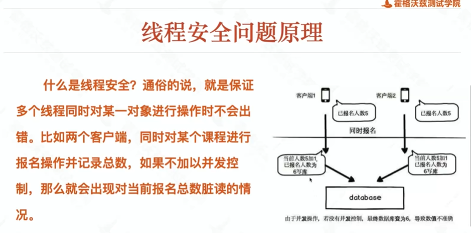

# 高并发下的分布式锁


插入两条一样的数据

# 分析
### 需求

	
### 并发问题
	
### 分布式问题
- 案例-分布式
 	
- 发现缺陷-分布式
	
```
redis+分布式锁
redis存数
redis差数时上锁，查完后解锁
redis变成线程通信工具
```
###  数据库锁原理
		
		
		
### 快照读和真读
<https://www.jianshu.com/p/27352449bcc0>
### 修复方法


对公共属性进行修改的方法，需要synchronized

加锁会被动的变成单线程方法
### 并发场景与性能测试的区别
		
### 系统复杂度的深度
```
初级：边界值方法等
中级：redis ,mq等
高级：并发，多线程等
```