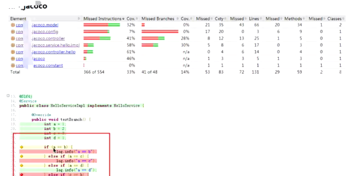

[官网下载地址](https://www.jacoco.org/jacoco/trunk/doc/agent.html)
---
### jacoco的使用简略步骤
  对被测服务插桩-> 打包执行-> 出报告

---

#### 方式一：远程tcp模式
```
# 启动服务并执行测试
# tcpserver适用于远程，需要开启端口。
# 需要注意，server会跟随被测jar包本身运行的停止而停止，所以被测jar包需要是一个长期运行的jar包。
# 否则output=tcpserver方式时，开放的端口服务会很快停止，可能最终dump的时候会提示 Connection refused .因为该端口上并没有任何服务在启动。
java -javaagent:jacocoagent.jar=includes=*,output=tcpserver,port=9100,address=127.0.0.1 -jar rest-service-0.0.1-SNAPSHOT.jar
#导出/更新.exec报告文件  
java -jar jacococli.jar dump --address 127.0.0.1 --port 9100 --destfile ./jacoco.exec --reset
#生成html
java -jar jacococli.jar report ./jacoco.exec --classfiles C:/Users/yindo/IdeaProjects/gs-rest-service/complete/target/classes --sourcefiles  C:/Users/yindo/IdeaProjects/gs-rest-service/complete/src/main/java --encoding utf-8 --html jacoReport
```
--- 
#### 方式二：file文件模式
- 启动服务并执行测试
```
# 该方式会生成一个本地的.exec文件,启动service时会初始化一个exec
# shutdown service时会更新exec内容,能实时更新吗？
java -javaagent:./jacoco/jacocoagent.jar=includes=*,output=file,destfile=jacoco.exec -jar ./target/rest-service-0.0.1-SNAPSHOT.jar
#生成html（同tcp模式）
java -jar ./jacoco/jacococli.jar report jacoco.exec --classfiles ./target/classes --sourcefiles  ./src/main/java --encoding utf-8 --html ./jacocoReport
 ```
---
#### 合并两个exec
```
java -jar jacococli.jar merge [<execfiles> ...] --destfile <path> [--help] [--quiet]
```
---
#### 报告图形
 
1. 红色没执行
2. 绿色执行
3. 黄色部分执行
---
### jenkins部署
1. 安装jacoco报告插件
2. 执行agent和cli，生成报告
3. 配置构建后操作-设置jacoco报告路径
---
### dockerfile编写