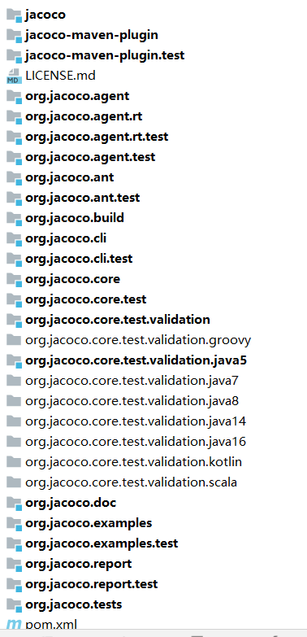
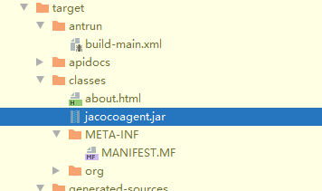
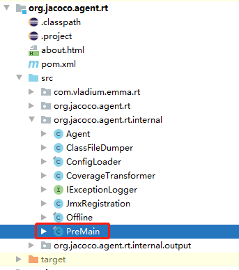
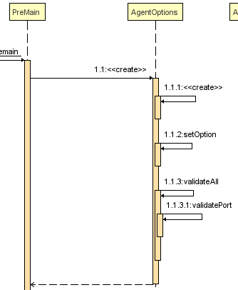
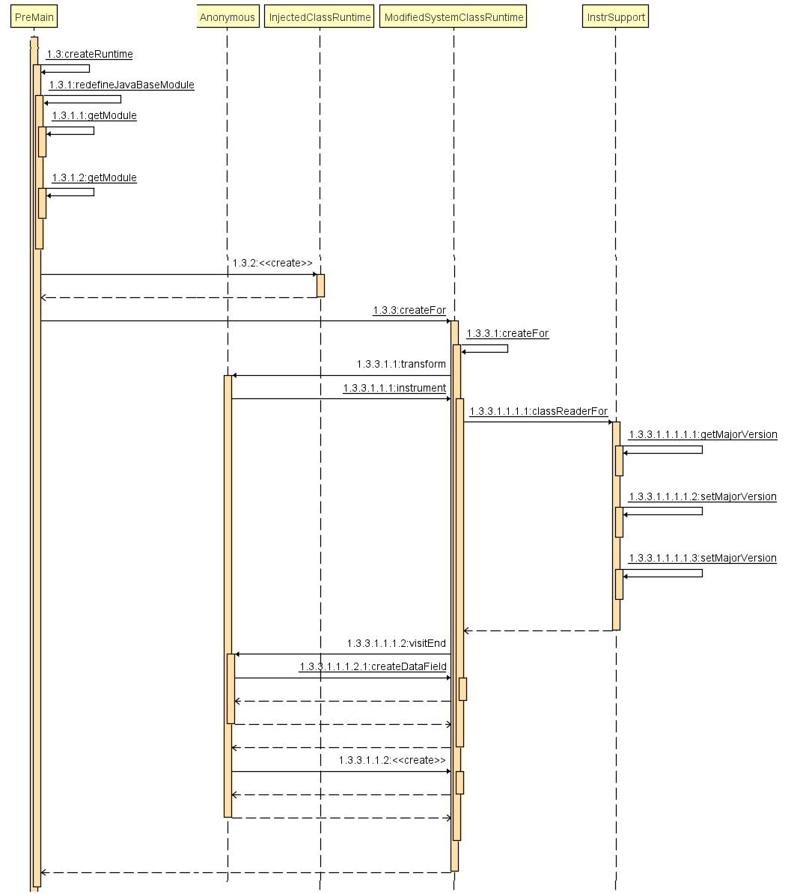
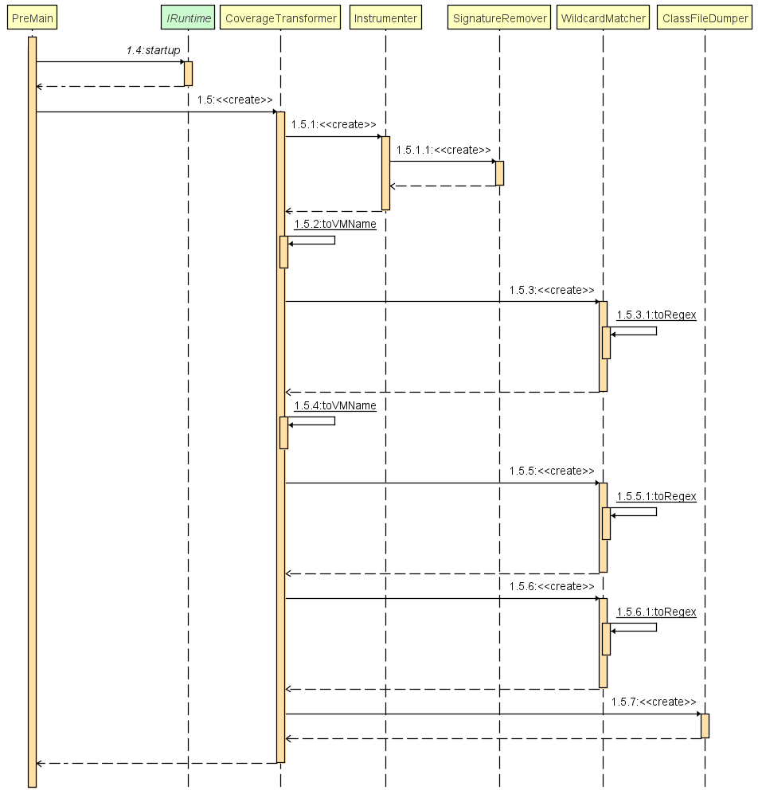

###项目结构：  

 
阅读词汇：
class File 字节码
Instrumentation 插桩
模块内容拆分
参考：<https://www.jacoco.org/jacoco/trunk/doc/api/index.html?overview-summary.html>  
 
*  Bundle org.jacoco.core  
>   核心包实现了代码覆盖技术。它提供 API 和implementation，用于class文件插桩, 收集runtime执行数据并分析覆盖率数据，分析覆盖数据。  
>   org.jacoco.core - jacoco源信息    
>   org.jacoco.core.analysis-覆盖率计算和分析  
>   org.jacoco.core.data-执行数据和会话信息的展示和持久化  
>   org.jacoco.core.instr-检测用于代码覆盖的 Java 类文件  
>   org.jacoco.core.runtime-运行控制和执行数据采集	 
>   org.jacoco.core.tools-使用jacoco核心api的工具集合	 
* Bundle org.jacoco.report
> 提供创建不同格式的覆盖率报告的api和implementation 
> org.jacoco.report	生成报告的公共接口和工具包(utilities)
> org.jacoco.report.check	规则检查实现.
> org.jacoco.report.csv	csv报告实现.
> org.jacoco.report.html	html报告实现.
> org.jacoco.report.xml	XML报告实现.
> 
* Bundle org.jacoco.agent
> 提供运行java代理jar包资源
> org.jacoco.agent	提供运行java代理jar包资源
> 
* JaCoCo Runtime
> com.vladium.emma.rt	兼容API for EMMA .
> org.jacoco.agent.rt	用于从被测 JVM 中访问 JaCoCo 代理的 API.  
 
***
### 项目本地执行（参考jacoco用途）  
> 只用了 jacocoagent.jar和jacococli.jar，看下这两个jar包。  
> jacocoagent看下 output(tcpserver时查看port,address)  
> jacococli看下dump(address,port),report  
***
### 项目本地打包
* jacocoagent.jar打包  
    - 先打包agentrt，再打包agent项目。    
        
    - 打包agentrt过程 mvn package
        ``` 
        downloading org.jacoco.core……
        downloading org.jacoco.build……
        create\resources\compile\testResources\testCompile\check org.jacoco.agent.rt
        Building jar: org.jacoco.agent.rt-0.8.8-SNAPSHOT.jar
        ```
        
    - 打包agent过程 mvn package
        ```
        downloading org.jacoco:org.jacoco.agent.rt
        building jar: org.jacoco.agent-0.8.8-SNAPSHOT.jar
        ```  
        
* jacococli.jar打包
    - 打包cli mvn package  
        
    - 打包过程 
        ```
        Downloading jacoco.core
        downloading jacoco.build
        building jar: org.jacoco.cli-0.8.8-SNAPSHOT.jar
        ```
***
### jacoco_agent_rt查看output-tcpserver  
1. 找到启动类 
    ```xml
    <configuration>
      ...
      <transformers>
        <transformer implementation="org.apache.maven.plugins.shade.resource.ManifestResourceTransformer">
          <manifestEntries>
            <Premain-Class>${jacoco.runtime.package.name}.PreMain</Premain-Class>
            ...
          </manifestEntries>
        </transformer>
      </transformers>
    </configuration>
    ``` 
     
   premain的使用方法可以参考：<https://www.jianshu.com/p/0bbd79661080>,<https://zhuanlan.zhihu.com/p/343282525>
   Instrumentation的用法可以参考：<https://blog.csdn.net/yczz/article/details/51656386>
   jvm的Instrumentation技术：<http://lovestblog.cn/blog/2015/09/14/javaagent/>
   premain主要代码如下（做一定的简略加工）：
   ```java 
    public static void premain(final String options, final Instrumentation inst)
    			throws Exception {
    		final AgentOptions agentOptions = new AgentOptions(options);
    		final Agent agent = Agent.getInstance(agentOptions);
    		final IRuntime runtime = createRuntime(inst);
    		runtime.startup(agent.getData());
    		inst.addTransformer(new CoverageTransformer(runtime, agentOptions,
    				IExceptionLogger.SYSTEM_ERR));
    	}
   
   	private static IRuntime createRuntime(final Instrumentation inst)
   			throws Exception {   
   		if ("executed on java9+Jres") {
   			return new InjectedClassRuntime(Object.class, "$JaCoCo");
   		}
   		return ModifiedSystemClassRuntime.createFor(inst,
   				"java/lang/UnknownError");
   	}
   
   }
   
   ```
   时序图
    
   根据时序图进行代码拆解阅读：  
   1.第一部分，AgentOptions初始化，主要处理cmd传入的参数。  
      
   2.第二部分，Agent初始化，使用的技术主要是jmx，建立tcp网络传输管道，用于传输数据。  
   
   3.第三部分，runtime初始化，使用的技术主要是asm，进行插桩数据加工  
     
   4.第四部分，字节码转换成instrument classes 用于代码分析，将分析结果dump到AgentOptions配置的地址  
     
   这里只讨论java8版本，上面主要调用的方法是:  
   - 创建runtime：  
    ModifiedSystemClassRuntime.createFor(inst,"java/lang/UnknownError");   
   - 将创建的代理对象传递给虚拟机，addTransformer会执行Transformer实现类的transform方法 
    inst.addTransformer(new CoverageTransformer(runtime, agentOptions, IExceptionLogger.SYSTEM_ERR));   
   - 创建的代理对象为：
    new CoverageTransformer(runtime, agentOptions, IExceptionLogger.SYSTEM_ERR)
   一些知识： 
    classFile=字节码  
    实现ClassFileTransformer接口的代理，可以在jvm加载类之前，改变类运行时的字节码。
    ClassFileTransformer需要添加到Instrumentation实例中才能生效。 
     
    ModifiedSystemClassRuntime主要代码如下（做一定的简略加工）：
    step1: 做基础的字节码transformer
    step2: 调用asm加工
    ``` 
   	public static IRuntime createFor(final Instrumentation inst,
    									 final String className, final String accessFieldName)
    			throws ClassNotFoundException {
    		//略
    		return new ModifiedSystemClassRuntime(clazz, "$jacocoAccess");
    	} 
   //instrument 检测
       	public static byte[] instrument(final byte[] source,
       			final String accessFieldName) {
       		final ClassReader reader = InstrSupport.classReaderFor(source);
       		final ClassWriter writer = new ClassWriter(reader, 0);
       		reader.accept(new ClassVisitor(InstrSupport.ASM_API_VERSION, writer) {
       			@Override
       			public void visitEnd() {
       				createDataField(cv, accessFieldName);
       				super.visitEnd();
       			}
       		}, ClassReader.EXPAND_FRAMES);
       		return writer.toByteArray();
       	}
       
       	private static void createDataField(final ClassVisitor visitor,
       			final String dataField) {
       		visitor.visitField(
       				Opcodes.ACC_PUBLIC | Opcodes.ACC_STATIC | Opcodes.ACC_SYNTHETIC
       						| Opcodes.ACC_TRANSIENT,
       				dataField, ACCESS_FIELD_TYPE, null, null);
       	}
       }
      ```
   
   
   
   
  
   
2. 