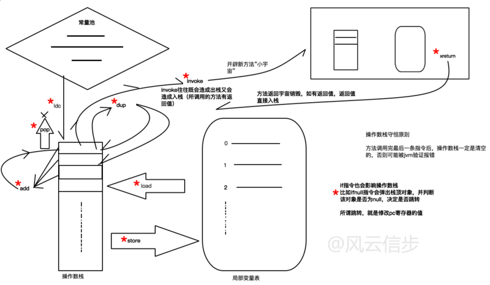
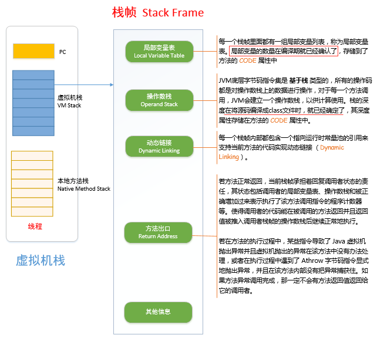
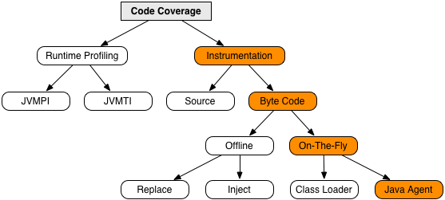

### 1.查看java生成的字节码文件，通过命令 javap -v -p ClassName
- 举例：.java代码如下
```
package com.example.restservice;

public class Greeting {

	private final long id;
	private final String content;

	public Greeting(long id, String content) {
		this.id = id;
		this.content = content;
	}

	public long getId() {
		return id;
	}

	public String getContent() {
		return content;
	}
}
```
- 执行命令：
```
javap -v -p Greeting.class
``` 
- 执行后查看字节码展示
```
Classfile /C:/Users/yindo/IdeaProjects/gs-rest-service/complete/target/classes/com/example/restservice/Greeting.class
  Last modified 2020-12-25; size 646 bytes
  MD5 checksum e86ed8397bf2072a94ab45f1eba6da9a
  Compiled from "Greeting.java"
public class com.example.restservice.Greeting
  minor version: 0
  major version: 52
  flags: ACC_PUBLIC, ACC_SUPER
Constant pool:
   #1 = Methodref          #5.#24         // java/lang/Object."<init>":()V
   #2 = Fieldref           #4.#25         // com/example/restservice/Greeting.id:J
   #3 = Fieldref           #4.#26         // com/example/restservice/Greeting.content:Ljava/lang/String;
   #4 = Class              #27            // com/example/restservice/Greeting
   #5 = Class              #28            // java/lang/Object
   #6 = Utf8               id
   #7 = Utf8               J
   #8 = Utf8               content
   #9 = Utf8               Ljava/lang/String;
  #10 = Utf8               <init>
  #11 = Utf8               (JLjava/lang/String;)V
  #12 = Utf8               Code
  #13 = Utf8               LineNumberTable
  #14 = Utf8               LocalVariableTable
  #15 = Utf8               this
  #16 = Utf8               Lcom/example/restservice/Greeting;
  #17 = Utf8               MethodParameters
  #18 = Utf8               getId
  #19 = Utf8               ()J
  #20 = Utf8               getContent
  #21 = Utf8               ()Ljava/lang/String;
  #22 = Utf8               SourceFile
  #23 = Utf8               Greeting.java
  #24 = NameAndType        #10:#29        // "<init>":()V
  #25 = NameAndType        #6:#7          // id:J
  #26 = NameAndType        #8:#9          // content:Ljava/lang/String;
  #27 = Utf8               com/example/restservice/Greeting
  #28 = Utf8               java/lang/Object
  #29 = Utf8               ()V
{
  private final long id;
    descriptor: J
    flags: ACC_PRIVATE, ACC_FINAL

  private final java.lang.String content;
    descriptor: Ljava/lang/String;
    flags: ACC_PRIVATE, ACC_FINAL

  public com.example.restservice.Greeting(long, java.lang.String);
    descriptor: (JLjava/lang/String;)V
    flags: ACC_PUBLIC
    Code:
      stack=3, locals=4, args_size=3
         0: aload_0
         1: invokespecial #1                  // Method java/lang/Object."<init>":()V
         4: aload_0
         5: lload_1
         6: putfield      #2                  // Field id:J
         9: aload_0
        10: aload_3
        11: putfield      #3                  // Field content:Ljava/lang/String;
        14: return
      LineNumberTable:
        line 8: 0
        line 9: 4
        line 10: 9
        line 11: 14
      LocalVariableTable:
        Start  Length  Slot  Name   Signature
            0      15     0  this   Lcom/example/restservice/Greeting;
            0      15     1    id   J
            0      15     3 content   Ljava/lang/String;
    MethodParameters:
      Name                           Flags
      id
      content

  public long getId();
    descriptor: ()J
    flags: ACC_PUBLIC
    Code:
      stack=2, locals=1, args_size=1
         0: aload_0
         1: getfield      #2                  // Field id:J
         4: lreturn
      LineNumberTable:
        line 14: 0
      LocalVariableTable:
        Start  Length  Slot  Name   Signature
            0       5     0  this   Lcom/example/restservice/Greeting;

  public java.lang.String getContent();
    descriptor: ()Ljava/lang/String;
    flags: ACC_PUBLIC
    Code:
      stack=1, locals=1, args_size=1
         0: aload_0
         1: getfield      #3                  // Field content:Ljava/lang/String;
         4: areturn
      LineNumberTable:
        line 18: 0
      LocalVariableTable:
        Start  Length  Slot  Name   Signature
            0       5     0  this   Lcom/example/restservice/Greeting;
}
SourceFile: "Greeting.java"
```
### 2.java字节码的含义解析
- 参考：<https://segmentfault.com/a/1190000008606277>


### 3.jacoco的插桩原理
- 参考：<https://www.jacoco.org/jacoco/trunk/doc/implementation.html>

- offline和on-the-fly的选择差异参考：
<https://testerhome.com/articles/16981>